# MiNi Game

**MiNi Game** is a collection of multiple **games** to serve the user a there fav **choices** and play.

## Features

- We can play any **games** we want.
- There are fun games with apps too.
- Every games has **sound effects** to add and extra impressio on user.
- We can switch **dark** and **light** mode on home page. Which is **common** is **projects** but it was on of the **best part** for me

## Technologies Used

- HTML
- CSS
- JavaScript (JS)

## How To Use?

1. Go on the site: [MiNi Games](https://beasttale19-cmd.github.io/Mini-Games)
2. Use the website and play game the way you want!

## Screenshots

### Home Page:
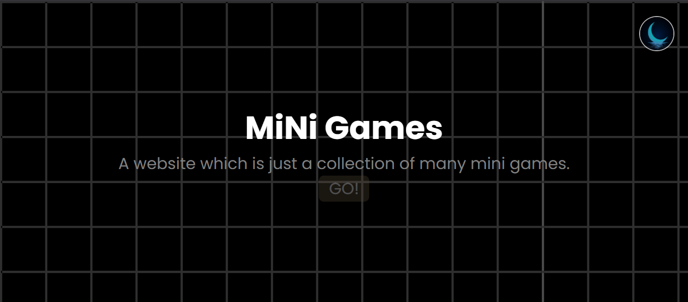
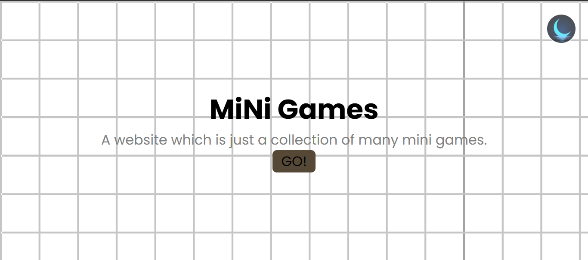

### Two D:
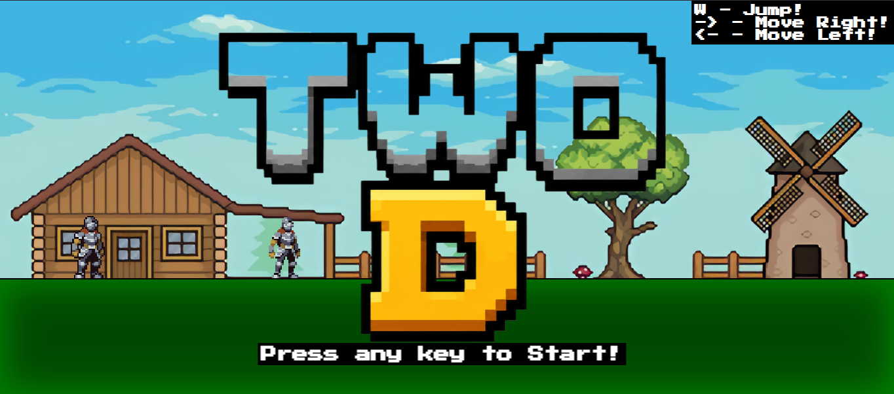
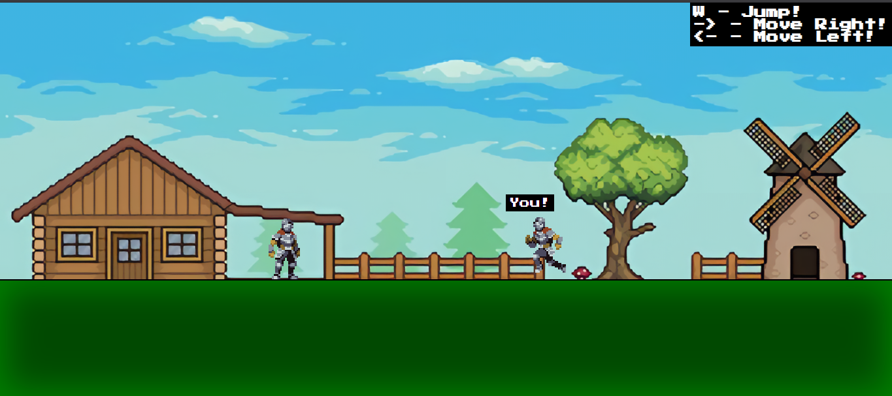

### Tic Tac Toe:
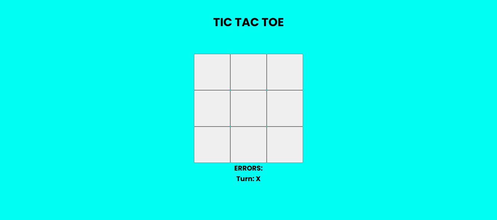
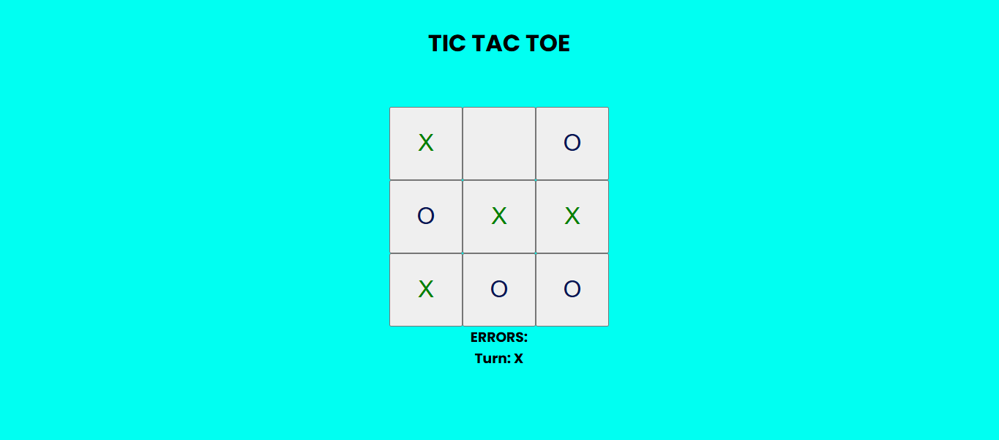

### Rock Paper Scissors:
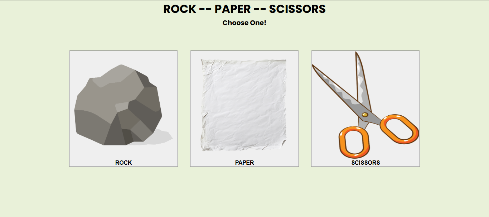
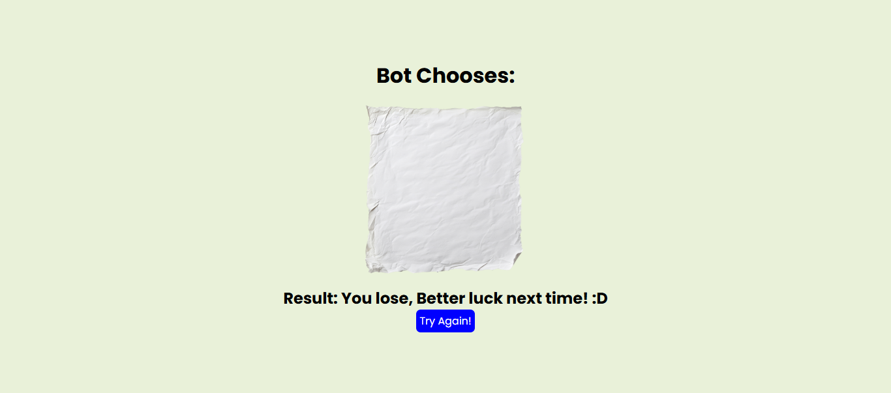

### Calculator:
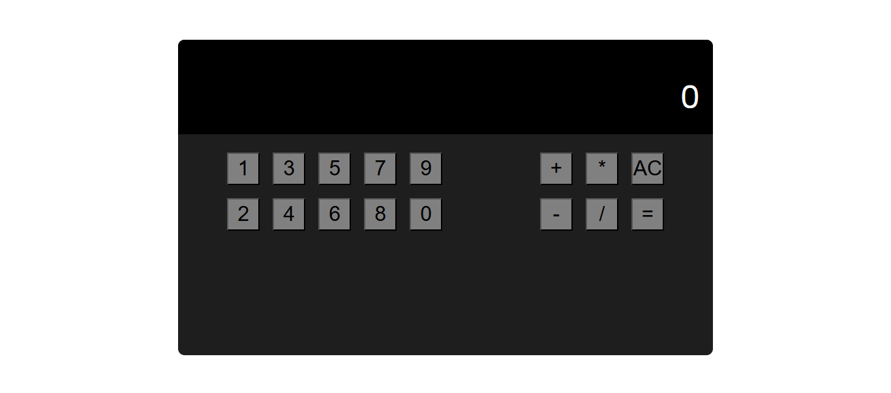
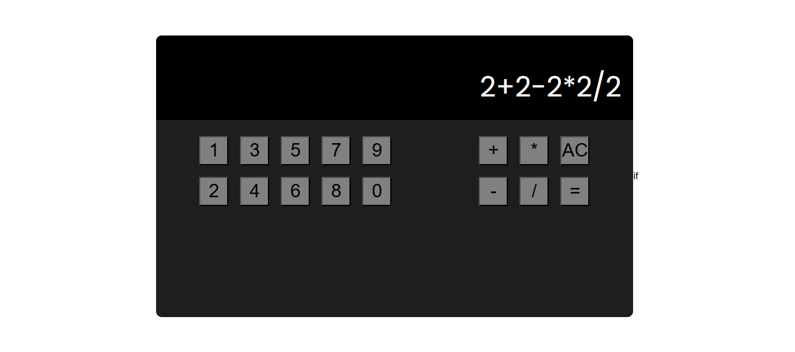

### Cookie Clicker:
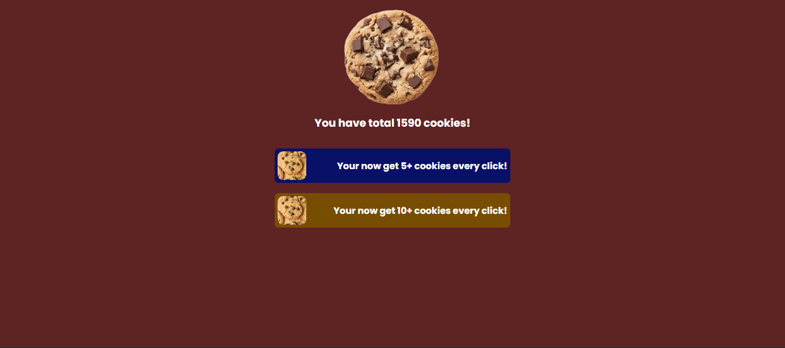

## Future Improvements

- I will improve Two D, it got so much bugs.
- I will add sound effects to calculator.
- I will imrpove and expand Cookie Clicker.

## Author

Nirjal Acharya - A **ninth** grade high school **web developer**. From **Nepal**. 

GitHub: [Click!](https://github.com/beasttale19-cmd/Mini-Games)
